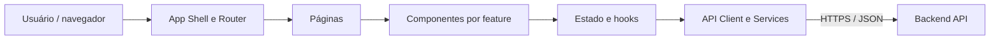

# Portal de Solicitações Internas — Frontend

SPA responsiva para autenticação, acompanhamento e gerenciamento de solicitações internas. O frontend é projetado em React com TypeScript, organizado por funcionalidades e com o acesso à API centralizado em uma camada de serviços.

## Executando o projeto

```bash
npm install
npm run dev
```

O frontend está integrado à API NestJS. Copie `.env.example` para `.env`, mantenha `VITE_API_URL=http://localhost:3000/api` e inicie o backend antes do Vite. O token JWT é enviado no cabeçalho `Authorization` e removido no logout ou quando a API responde `401`.

Contas criadas pelo seed do backend:

- solicitante: `marina@empresa.com` / `123456`;
- atendente: `tiago@empresa.com` / `123456`.

### Qualidade

```bash
npm test
npm run lint
npm run build
```

A implementação segue a separação descrita abaixo: shell e rotas em `src/app`, composição em `src/pages`, componentes em `src/features`, estado remoto em `src/hooks`, transporte e mocks em `src/services`, validações em `src/schemas` e contratos em `src/types`.

## Funcionalidades previstas

- autenticação e encerramento de sessão;
- dashboard com totais de solicitações por status;
- listagem paginada de solicitações;
- filtros por período, categoria, status e título;
- criação e visualização de solicitações;
- edição e exclusão somente pelo autor da solicitação;
- alteração de status conforme as regras expostas pela API;
- estados de carregamento, erro e ausência de dados;
- interface adaptável a desktop e dispositivos móveis.

## Arquitetura



### Responsabilidades por camada

| Camada                  | Responsabilidade                                                         |
| ----------------------- | ------------------------------------------------------------------------ |
| App Shell / Router      | Layout, navegação, rotas públicas e protegidas e error boundary          |
| Páginas                 | Composição das telas e coordenação dos casos de uso da interface         |
| Componentes por feature | Formulários, tabelas, filtros, indicadores e diálogos reutilizáveis      |
| Estado / hooks          | Autenticação, consultas, filtros e estados de carregamento e erro        |
| API Client / Services   | Comunicação HTTP, envio da credencial e tratamento centralizado de `401` |
| Validação / UI          | Schemas de formulário, mensagens, toasts, empty states e responsividade  |

Uma estrutura sugerida para a implementação é:

```text
src/
├── app/                 # bootstrap, router, providers e layout
├── features/
│   ├── auth/
│   ├── dashboard/
│   └── requests/
├── pages/
├── services/            # httpClient e serviços da API
├── hooks/
├── components/          # componentes compartilhados
├── schemas/             # validações de formulário
└── types/
```

## Rotas

| Rota                 | Acesso    | Finalidade                    |
| -------------------- | --------- | ----------------------------- |
| `/login`             | Público   | Autenticação do usuário       |
| `/dashboard`         | Protegido | Indicadores consolidados      |
| `/requests`          | Protegido | Listagem, paginação e filtros |
| `/requests/new`      | Protegido | Criação de solicitação        |
| `/requests/:id`      | Protegido | Detalhes da solicitação       |
| `/requests/:id/edit` | Protegido | Edição de solicitação aberta  |

A proteção de rota no navegador melhora a experiência do usuário, mas não substitui a autenticação e a autorização no backend.

## Componentes principais

- `LoginForm`: valida e envia as credenciais.
- `RequestForm`: atende aos fluxos de criação e edição.
- `RequestTable`: apresenta os resultados paginados.
- `RequestFilters`: converte os filtros em query parameters.
- `StatusBadge`: padroniza a representação visual dos status.
- `DashboardCards`: exibe total, abertas, em andamento e concluídas.
- `ConfirmDialog`: confirma operações destrutivas, como exclusão.

## Integração com a API

O frontend consome os seguintes grupos de recursos:

```text
/api/auth/*
/api/requests/*
/api/dashboard/summary
```

O cliente HTTP deve concentrar a URL base, serialização JSON, credenciais e tratamento de erros. Ao receber `401 Unauthorized`, a aplicação deve limpar o estado autenticado e redirecionar o usuário para `/login`.

### Sessão

A API utiliza JWT Bearer. O cliente mantém o token no `localStorage`, anexa-o centralmente em `httpClient` e o descarta no logout ou após uma resposta `401`. Para um ambiente público, a evolução recomendada é adotar cookie `HttpOnly`, `Secure` e uma política `SameSite` adequada.

## Fluxos principais

### Login

1. O formulário valida os campos.
2. A aplicação envia `POST /api/auth/login`.
3. Com sucesso, atualiza o estado autenticado.
4. O usuário é redirecionado para `/dashboard`.
5. Uma resposta `401` encerra a sessão local e retorna para `/login`.

### Solicitações

1. A tabela consulta a API com paginação.
2. Período, categoria, status e busca textual são enviados como query parameters.
3. Criação e edição compartilham o `RequestForm`.
4. A interface só oferece edição ou exclusão ao autor da solicitação.
5. Depois de uma mutação, os dados afetados são consultados novamente ou invalidados no cache.

### Dashboard

1. A aplicação consulta `GET /api/dashboard/summary`.
2. Quatro indicadores apresentam total, abertas, em andamento e concluídas.
3. A tela trata explicitamente carregamento, erro e ausência de dados.

Os componentes visuais não devem conhecer detalhes do transporte HTTP; essa responsabilidade pertence aos hooks e serviços.

## Estado e cache

O estado de autenticação pode ser mantido em um Context ou store dedicado. Dados remotos devem permanecer próximos de seus hooks (`useRequests`, `useRequestFilters` e `useDashboard`). TanStack Query pode ser adotado para cache, refetch e invalidação após mutations, evitando estado global desnecessário.

## Configuração esperada

Quando a aplicação for implementada, documente no `.env.example` ao menos a URL pública da API, por exemplo:

```dotenv
VITE_API_URL=http://localhost:3000/api
```

O nome efetivo da variável dependerá da ferramenta de build escolhida.

## Qualidade

A entrega deve incluir lint, checagem de tipos, testes de componentes e dos fluxos críticos, build de produção e validação de responsividade e acessibilidade. No pipeline de CI, essas verificações devem ocorrer antes da geração da imagem Docker.

## Diagramas de referência

- [Arquitetura do frontend](./arquitetura_frontend_portal_solicitacoes.excalidraw.md)
- [Arquitetura geral da solução](./arquitetura_portal_solicitacoes.excalidraw.md)
